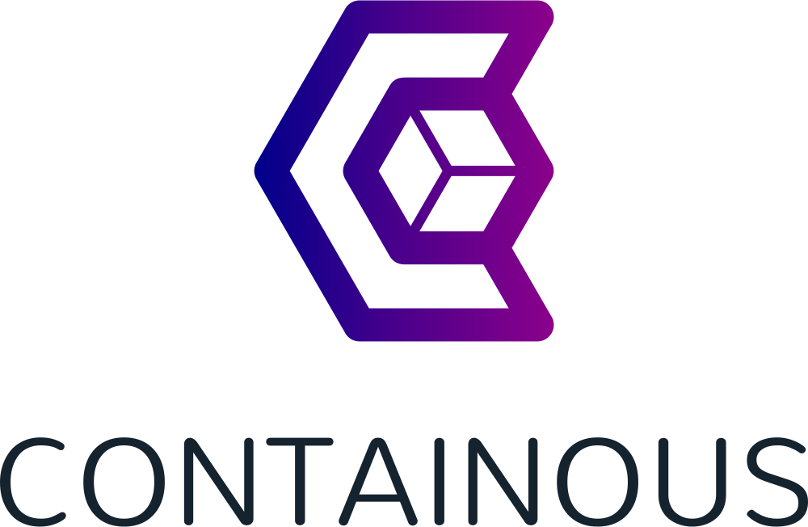

How to write a reverse-proxy in 25 minutes?
***
https://github.com/juliens

@juguul

Note: Good morning, my name is Julien,

**

Note:  I'm a Go developer. I work at Containous.
**

Note: Containous is a company behind an open source project named Traefik.
**
Traefik
a modern HTTP reverse proxy and load balancer made to deploy microservices with
ease

Note: And Traefik is an open source reverse proxy made to deploy microservices with ease.
It means that Traefik doesn't need any configuration file. It will connect to
your orchestrator API and then it will refresh dynamically its configuration by
listening to your orchestrator events.

***

Note: So today, It makes sense for me to talk to you about how to write a reverse proxy.

**


Note: When I start to work on a presentation, I usually search for the main words of my
talk in Wikipedia, because everybody knows that Wikipedia is the real truth.

**
A reverse proxy is a type of proxy server that retrieves resources on behalf
of a client from one or more servers. These resources are then returned to the
client as if they originated from the Web server itself.

Note: And if we search on Wikipedia for reverse-proxy, we can read something
like this:

**
A reverse proxy is a type of **proxy server** that retrieves resources on behalf
of a **client** from one or more **servers**. These resources are then **returned to the
client** as if they originated from the Web server itself.

Note: If we highlight the most important words, we can say something like "This is a **proxy server** that **returned** resources from **servers** to a **client**"
**
- Server
- Client
- (Proxy) Server
- Returned (resources)

Note: So for this live coding session, we will need a server, a client and then we will live a code a proxy server to returned resources.
***


## Server


Note: Let's start with the server. I think that today, the simplest server we can have is a docker container.

**


Note: So we run a simple container that I have already prepare for this demo, named demo.

***
##Client
Note: For the client, I could have taken a browser, but with a browser it could
be difficult to verify some "raw" information. So I prefer to use the curl command.
**

Note:
So we just need to get the ip of our container, and then we try to call an url on it,
with curl.
And we have all we need!
***
##Proxy server

Note: 3.35 For the proxy server, this is where we start the live coding. We have
a main. If we need a server, we can use the http package to launch a webserver with HTTP Listen and serve. Now let's try this server with the curl command.
***
## returned to the client
Note: And now, we need to returned resources to the client
We create the URL with our container IP. And then we use the http.ReverseProxy. And we try again our curl command. And this ok!
**
## 30 min ?

<!-- .slide: class="backgrounded" data-background="./img/past2.jpg" -->
Note: Thank you very much and do you have questions, oh yes, I didn't use the 25 minutes.
We will deep dive in this reverse proxy implementation. But I think this is important to
know that if you need a reverse proxy in go, you can use this implementation. It is maintain by the go team. And it is improved in every release. For example, in the 1.12, they add the support of websocket.
**
<!-- .slide: data-background="./img/pieces-detachees-auto.jpg" -->

##Deep Dive

***
<!-- .slide: data-background="./img/Background.svg" data-background-color="#DDD" -->

Note: Now let's start to implement the guts of this reverse proxy. For this, I made a list of things to do. And the first one is "Forward request"

**
## Forward request

**
<!-- .slide: data-background="./img/Forward.svg" data-background-color="#DDD" -->
***
## Copy response
**
<!-- .slide: data-background="./img/Copy_response.svg" data-background-color="#DDD" -->
***
## Copy Response headers
**
<!-- .slide: data-background="./img/Copy_response_headers.svg" data-background-color="#DDD" -->
**
##X-Forwarded-For
**
<!-- .slide: data-background="./img/XForwardedFor1.svg" data-background-color="#DDD" -->

**
<!-- .slide: data-background="./img/XForwardedFor.svg" data-background-color="#DDD" -->

***
## Stream
**
<!-- .slide: data-background="./img/Stream.svg" data-background-color="#DDD" -->

***
## Trailer

**

## Trailer
```
rw.Header().Set("Trailer", "X-Trailer,X-T2")  // announce trailers
rw.WriteHeader(http.StatusOK) // Write header
rw.Write(body) // Write Body
rw.Header().Set("X-Trailer", "Value") // Fill the trailer value
```

**
## raw chunked body
```
[Chunk size]
Chunk Content
[Chunk size] // If 0 this is trailer
Chunk Content
```
**
## raw chunked body
```
5
HELLO
0
X-Trailer: Value
```
**
## client part
```
fmt.Println(resp.Trailer) // map with only keys
ioutil.ReadAll(resp.Body) // read all the chunk
fmt.Println(resp.Trailer) // map with trailers values
```
***
## HTTP2

**
HTTP2 needs HTTPS

**
~~HTTP2 needs HTTPS~~
HTTP2 needs knowledge

**
## TLS ALPN
**
<!-- .slide: data-background="./img/TLSALPN.svg" data-background-color="#DDD" -->

**
## HTTP2 + Trailer = ?

**
## HTTP2 + Trailer = gRPC


***
##Next
 - WebSocket
 - TrailerPrefix
 - h2c
 - TCP
 - ...

***
Questions ?
