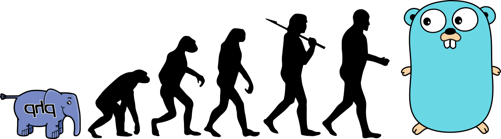

Ecrire un reverse-proxy
avec go
en 30 mins

Note: Bonjour à tous, merci d'être venu à ce talk, ou je vais vous expliquer
comment on peut ecrire un reverse proxy avec go en 30mins. Tout d'abord je vais
me présenter, car je suis un peu nouveau dans la communauté go

***
JulienS

note: je m'appele Julien, je fais du dev depuis +10 (après on compte plus de
toute facon) et je suis nouveau dans la communauté go car je faisais du PHP
**

note: oui je sais, chacun ces problèmes dans la vie, mais donc, je me suis mis
au go, et j'ai rejoins la société ...
**

Note: Containous, et chez Containous, nous travaillons plus particulièrement
sur ...
**

Note: Traefik ! Alors je pense que si vous faites du go à Lyon, vous avez surement
deja entendu parler de Traefik, mais rapidement Traefik kezako 
**
a modern HTTP reverse proxy and load balancer made to deploy microservices with
ease

Note: Traefik c'est un reverse proxy et load balancer modern, créé pour
deployer des microservices facilement. En gros c'est un reverse proxy qui se
reload à chaud, en se basant directement sur ce qui est déployé dans les
orchestrators. Bon et si on commencait à créer le notre de reverse proxy

***
Wikipedia

Note: Alors moi, quand je connais pas très bien un truc, je cherche ce que
c'est sur Wikipedia, car tout le monde sait que Wikipedia est la vérité absolue
**
a reverse proxy is a type of proxy server that retrieves resources on behalf
of a client from one or more servers. These resources are then returned to the
client as if they originated from the Web server itself.

Note: Si on cherche reverse proxy sur Wikipedia, on tombe sur cette
définition, si on prends les mots importants
**
a reverse proxy is a type of **proxy server** that retrieves resources on behalf
of a **client** from one or more **servers**. These resources are then **returned to the
client** as if they originated from the Web server itself.

Note: cela nous donne a peu près ca
***
servers !!

**

***
client 
** 

***
proxy server

**
ListenAndServe (demo)

***
returned to the client
**
httptest.ReverseProxy (demo)
**
30 min ?

**
<!-- .slide: data-background="./img/pieces-detachees-auto.jpg" -->

##Deep Dive
***
Send Request

**
RoundTrip (demo)

***
Copy response

**
io.Copy (demo)

***
Response headers

**
image exemple

**
copy headers (demo)

***
Hop-By-Hop

**
What is this ?

**
RFC
 The following HTTP/1.1 headers are hop-by-hop headers:
      - Connection
      - Keep-Alive
      - Proxy-Authenticate
      - Proxy-Authorization
      - TE
      - Trailers
      - Transfer-Encoding
      - Upgrade

Other hop-by-hop headers MUST be listed in a Connection header, (section 14.10) to be introduced into HTTP/1.1 (or later). 

**
Delete (demo)

***
X-Forwarded

**
X-Forwarded-For
X-Forwarded-Host
X-Forwarded-Port

***
Path problem ?

***
Trailer

***
Stream

***
HTTP2

***
WebSocket ?

